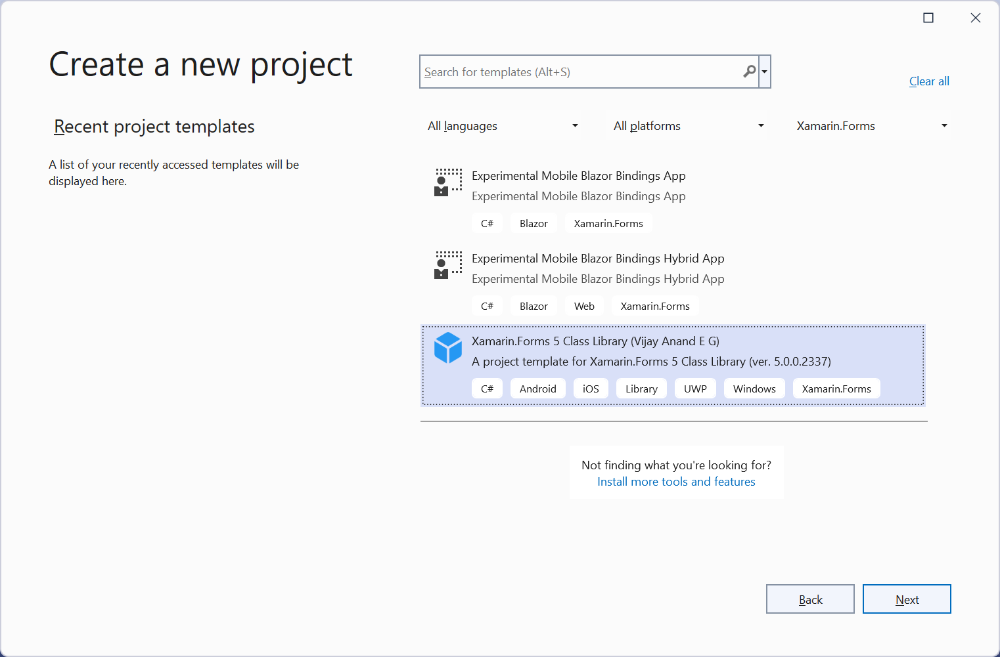
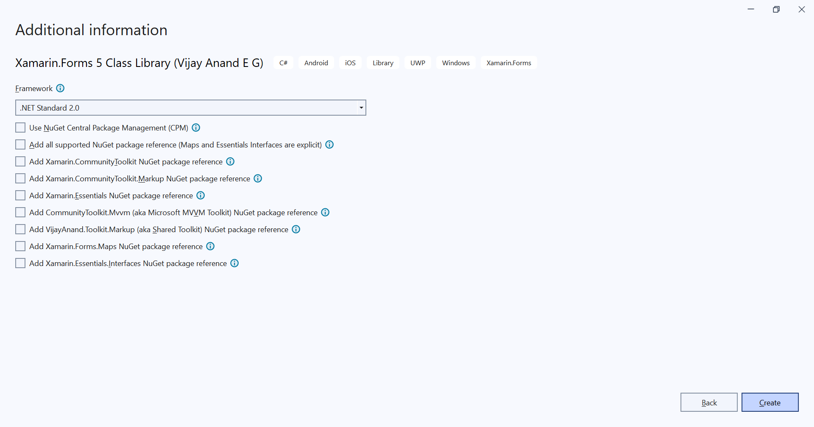
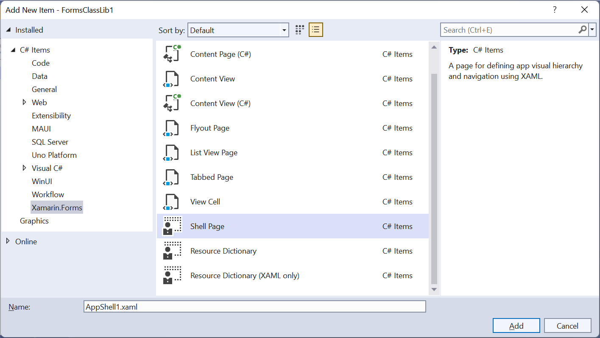

### Xamarin.Forms Project and Item Templates for building native apps for iOS, Android, UWP, macOS, Tizen from a single, shared C# codebase.

Join me on [**Developer Thoughts**](https://egvijayanand.in/), an exclusive blog for Xamarin.Forms, .NET MAUI, and Blazor with articles on working with it.

#### Available to install from

|NuGet|VS Marketplace|
|:---:|:---:|
|[](https://www.nuget.org/packages/VijayAnand.FormsTemplates/)|[](https://marketplace.visualstudio.com/items?itemName=egvijayanand.xamarin-forms-templates)|

#### Access within Visual Studio IDE

Installation:


Project Template Listing:



Project Options:



Item Templates:



#### Access via CLI

To install the template NuGet package, use the below .NET CLI command:

```shell
dotnet new install VijayAnand.FormsTemplates
```

If you've already installed this package, then it can be updated to the latest version with the below command:

```shell
dotnet new update --check-only
```
```shell
dotnet new update
```

#### Templates Included

Project template for Xamarin.Forms 5 Class Library and is named as `formsclasslib`

Class library project template take the below optional parameters to override its target framework and to include the officially supported [Xamarin.CommunityToolkit](https://www.nuget.org/packages/Xamarin.CommunityToolkit), [Xamarin.CommunityToolkit.Markup](https://www.nuget.org/packages/Xamarin.CommunityToolkit.Markup), [Xamarin.Essentials](https://www.nuget.org/packages/Xamarin.Essentials), [CommunityToolkit.Mvvm](https://www.nuget.org/packages/CommunityToolkit.Mvvm) (aka Microsoft MVVM Toolkit), [VijayAnand.Toolkit.Markup](https://www.nuget.org/packages/VijayAnand.Toolkit.Markup) (the Shared Toolkit) or all NuGet packages:

* `-f` | `--framework` - Default value is `netstandard2.0`
* `-asp` | `--all-supported-packages` - Default value is `false`
* `-it` | `--include-toolkit` - Default value is `false`
* `-im` | `--include-markup` - Default value is `false`
* `-ie` | `--include-essentials` - Default value is `false`
* `-imt` | `--include-mvvm-toolkit` - Default value is `false`
* `-ist` | `--include-shared-toolkit` - Default value is `false`

Explicit option:

* `-iei` | `--include-essentials-interfaces` - Default value is `false`

*Note: The NuGet package version being added out-of-the-box are v2.0.x for the Xamarin Toolkit packages, v1.8.x for the Xamarin.Essentials package, and v8.2.x for the MVVM Toolkit package.*

|Item|Template Name|
|:---:|:---:|
|ContentPage (XAML)|forms-page|
|ContentPage (C#)|forms-page-cs|
|ContentView (XAML)|forms-view|
|ContentView (C#)|forms-view-cs|
|ResourceDictionary (XAML)|forms-resdict|
|ShellPage (XAML)|forms-shell|
|ShellPage (C#)|forms-shell-cs|

Use the below .NET CLI command to create the project, pages, and views out these templates:

Class Library:

```shell
dotnet new formsclasslib -o MyApp.Core
```

Library target framework override:

```shell
dotnet new formsclasslib -o MyApp.Core -f netstandard2.1
```

Option to include NuGet packages:

```shell
dotnet new formsclasslib -o MyApp.UI -it -im -ie -iei -imt -ist
```

In a single parameter (Essentials Interfaces is an exception, to be explicitly mentioned):

```shell
dotnet new formsclasslib -o MyApp.UI -asp -iei
```

NuGet Central Package Management (CPM) feature:

_For now, this is supported only on CLI. Can be used in combination with other parameters too._

```shell
dotnet new formsclasslib -o MyApp.UI -cpm
```

Here, `-n` denotes the name of the Page/View that is to be created (for Pages/Shell/Views, don't need to suffix the type like `HomePage`, `OrderView`, `AppShell` and file extension `.xaml` / `.cs`, it will be added automatically) (Can also be specified as `--name` in the expanded form).

*Just mention only the name of the item that is to be created. Item Type and File Extension would be automatically added.*

*Note: If name parameter is not provided, the .NET CLI template engine will take the current folder name in the context as its name.*

And `-na` denotes the namespace under which the file is to be created (Can also be specified as `--namespace` in the expanded form).

*While working with .NET 7 or higher SDK, the namespace parameter in short notation needs to be passed as `-p:na` (i.e., it needs to be prefixed with `-p:`).*

Page:

```shell
dotnet new forms-page -n Login -na MyApp.Views
```
```shell
dotnet new forms-page-cs -n Home -na MyApp.Views
```

View:

```shell
dotnet new forms-view -n Card -na MyApp.Views
```
```shell
dotnet new forms-view-cs -n Order -na MyApp.Views
```

Shell:

```shell
dotnet new forms-shell -n App -na MyApp
```
```shell
dotnet new forms-shell-cs -n Mobile -na MyApp
```

Resource Dictionary:

With C# code-behind file:

```shell
dotnet new forms-resdict -n DefaultTheme -na MyApp.Themes
```

Without C# code-behind file - Xaml only (The option to be specified is `-xo` or `--xaml-only`):

```shell
dotnet new forms-resdict -n DarkTheme -na MyApp.Themes -xo
```
