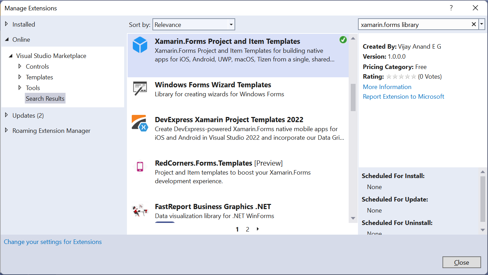
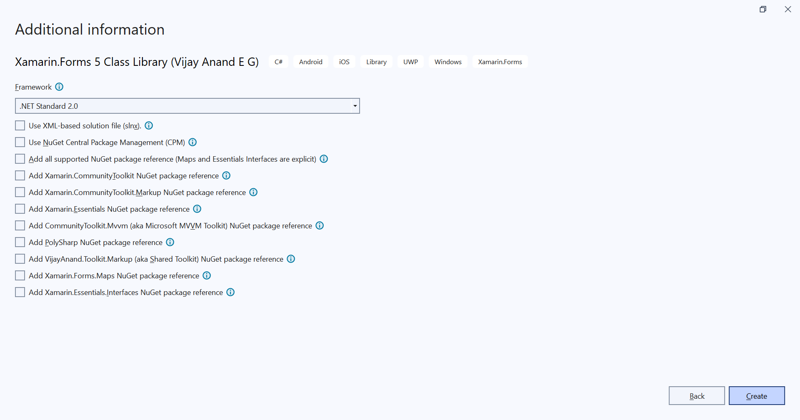

### Xamarin.Forms Project and Item Templates for building native apps for iOS, Android, UWP, macOS, Tizen from a single, shared C# codebase.

Join me on [**Developer Thoughts**](https://egvijayanand.in/), an exclusive blog for Xamarin.Forms, .NET MAUI, and Blazor with articles on working with it.

Consult this [Xamarin.Forms Templates](https://egvijayanand.in/2024/01/26/introducing-xamarin-forms-templates/) article for further details.

#### Available to install from

|NuGet|VS Marketplace|
|:---:|:---:|
|[](https://www.nuget.org/packages/VijayAnand.FormsTemplates/)|[](https://marketplace.visualstudio.com/items?itemName=egvijayanand.xamarin-forms-templates)|

#### Access within Visual Studio IDE

Installation:



Project Template Listing:


Project Options:



Item Templates:


#### Access via CLI

To install the template NuGet package, use the below .NET CLI command:

```shell
dotnet new install VijayAnand.FormsTemplates
```

If you've already installed this package, then it can be updated to the latest version with the below command:

```shell
dotnet new update --check-only
```
```shell
dotnet new update
```

#### Templates Included

Project template for Xamarin.Forms 5 Class Library and is named as `formsclasslib`

Class library project template take the below optional parameters to override its target framework and to include the officially released  [Xamarin.Forms.Maps](https://www.nuget.org/packages/Xamarin.Forms.Maps), [Xamarin.CommunityToolkit](https://www.nuget.org/packages/Xamarin.CommunityToolkit), [Xamarin.CommunityToolkit.Markup](https://www.nuget.org/packages/Xamarin.CommunityToolkit.Markup), [Xamarin.Essentials](https://www.nuget.org/packages/Xamarin.Essentials), [CommunityToolkit.Mvvm](https://www.nuget.org/packages/CommunityToolkit.Mvvm) (aka Microsoft MVVM Toolkit), [VijayAnand.Toolkit.Markup](https://www.nuget.org/packages/VijayAnand.Toolkit.Markup) (aka Shared Toolkit) or all NuGet packages:

* `-f` | `--framework` - Default value is `netstandard2.0`
* `-asp` | `--all-supported-packages` - Default value is `false`
* `-it` | `--include-toolkit` - Default value is `false`
* `-im` | `--include-markup` - Default value is `false`
* `-ie` | `--include-essentials` - Default value is `false`
* `-imt` | `--include-mvvm-toolkit` - Default value is `false`
* `-ist` | `--include-shared-toolkit` - Default value is `false`

Explicit option:

* `-inm` | `--include-maps` - Default value is `false`
* `-iei` | `--include-essentials-interfaces` - Default value is `false`

*Note: The NuGet package version being added out-of-the-box are v5.x for the Xamarin packages, v2.x for the Xamarin Toolkit packages, v1.x for the Xamarin.Essentials package, and v8.x for the MVVM Toolkit package. The latest stable version.*

|Item|Template Name|
|:---:|:---:|
|[Xamarin.Forms Item (XAML)](#generic-item-templates)|forms-item|
|[Xamarin.Forms Item (C#)](#generic-item-templates)|forms-item-cs|
|[ContentPage and ViewModel (XAML)](#mvvm-item-templates)|forms-mvvm|
|[ContentPage and ViewModel (C#)](#mvvm-item-templates)|forms-mvvm-cs|
|ContentPage (XAML)|forms-page|
|ContentPage (C#)|forms-page-cs|
|ContentView (XAML)|forms-view|
|ContentView (C#)|forms-view-cs|
|ResourceDictionary (XAML)|forms-resdict|
|ShellPage (XAML)|forms-shell|
|ShellPage (C#)|forms-shell-cs|

Use the below .NET CLI command to create the project, pages, and views out these templates:

Class Library:

```shell
dotnet new formsclasslib -o MyApp.Core
```

Library target framework override:

```shell
dotnet new formsclasslib -o MyApp.Core -f netstandard2.1
```

Option to include NuGet packages:

```shell
dotnet new formsclasslib -o MyApp.UI -it -im -ie -iei -imt -inm -ist
```

In a single parameter (Maps and Essentials Interfaces are exceptions, to be explicitly mentioned):

```shell
dotnet new formsclasslib -o MyApp.UI -asp -iei -inm
```

NuGet Central Package Management (CPM) feature:

*This can be used in combination with other parameters too.*

```shell
dotnet new formsclasslib -o MyApp.UI -cpm
```

Here, `-n` denotes the name of the Page/View that is to be created (for Pages/Shell/Views, don't need to suffix the type like `HomePage`, `OrderView`, `AppShell` and file extension `.xaml` / `.cs`, it will be added automatically) (Can also be specified as `--name` in the expanded form).

*Just mention only the name of the item that is to be created. Item Type and File Extension would be automatically added.*

*Note: If name parameter is not provided, the .NET CLI template engine will take the current folder name in the context as its name.*

And `-na` denotes the namespace under which the file is to be created (Can also be specified as `--namespace` in the expanded form).

*While working with .NET 7 or higher SDK, the namespace parameter in short notation needs to be passed as `-p:na` (i.e., it needs to be prefixed with `-p:`).*

#### Generic Item Templates:


* An innovative generic item template, in XAML and C#, for creating items of any type
* Supported both within the VS2022 IDE and CLI
* On CLI, it is named as `forms-item` and `forms-item-cs`
* The same set of parameters is defined in the UI as `Dropdown`, `TextBox` and `CheckBox` for ease of use
* Both need one required parameter, `-b` / `--base`, the base type
* Optionally takes another parameter, `-g` / `--generic`, to specify the generic base type
* In addition, the XAML template takes one more parameter, `-xo` / `--xaml-only`, when defined, generates only the XAML definition
* Frequently used base types are loaded in the Editable dropdown, user can also enter their value here
* Ensure the values are entered in Pascal notation. XAML templates support XML namespace prefix, quite like how it is used in real world (`xct:Popup`)
* The one big advantage of using this on IDE is the relative namespace to the folder where the item is created whereas on CLI, this defaults to the root namespace. As relative namespace resolution is yet to be fully supported by the CLI templating engine and is actively tracked [here](https://github.com/dotnet/templating/issues/6010)


*Note: Namespace resolution in both XAML and C# files is left to the user as deriving them with the template is outside its scope.*

*Tip 1: For XAML template, pass the `xmlns` scope, like `xct:Popup`, as part of the input parameter value and it'll be used appropriately in the generated source files.*

*Tip: Tip: Use `local` scope (a predefined scope in the template) to refer to the types in the same directory like `Views`. For e.g., `local:BasePage`.*

Example:

*Suffixes like Page, View, and so on are necessary while using generic item templates.*

```shell
dotnet new forms-item -n ThemePopup -b xct:Popup -p:na MyApp.Views
```

**Output:** `ThemePopup.xaml` and `ThemePopup.xaml.cs`

```cs
public partial class ThemePopup : Popup {}
```

```shell
dotnet new forms-item -n SearchPage -b FormsPage -g SearchViewModel -p:na MyApp.Views
```

**Output:** `SearchPage.xaml` and `SearchPage.xaml.cs`

```cs
public partial class SearchPage : FormsPage<SearchViewModel> {}
```

#### MVVM Item Templates:

* Introduced an item template to generate Page and its ViewModel in a single command, available for both XAML and C#
* The Page will be generated in the Views folder and ViewModel will be generated in the ViewModels folder
* Can also be overridden to generate in the same folder with the `-sf` | `--same-folder` option
* The ViewModels are generated with the base class titled `BaseViewModel` *(implementation left to the user)*
* Including [CommunityToolkit.Mvvm](https://www.nuget.org/packages/CommunityToolkit.Mvvm), an officially supported NuGet package, would be the best fit as it makes it easy to work with the MVVM design pattern
* And it's recommended to use this MVVM template from the project root. So that output is aligned to the folder structure

*Note: Don't suffix anything to the name, it'll be included automatically.*

```shell
dotnet new forms-mvvm -n Login -p:na MyApp
```
```shell
dotnet new forms-mvvm-cs -n Search -p:na MyApp
```

**Output Structure:**

XAML:

ViewModels
&emsp;LoginViewModel.cs
Views
&emsp;LoginPage.xaml
&emsp;LoginPage.xaml.cs

C#:

ViewModels
&emsp;SearchViewModel.cs
Views
&emsp;SearchPage.cs

**Page:**
```shell
dotnet new forms-page -n Login -p:na MyApp.Views
```
```shell
dotnet new forms-page-cs -n Home -p:na MyApp.Views
```

**View:**
```shell
dotnet new forms-view -n Card -p:na MyApp.Views
```
```shell
dotnet new forms-view-cs -n Order -p:na MyApp.Views
```

**Shell:**
```shell
dotnet new forms-shell -n App -p:na MyApp
```
```shell
dotnet new forms-shell-cs -n Mobile -p:na MyApp
```

**Resource Dictionary:**

With C# code-behind file:
```shell
dotnet new forms-resdict -n DefaultTheme -p:na MyApp.Themes
```

Without C# code-behind file - Xaml only (The option to be specified is `-xo` or `--xaml-only`):
```shell
dotnet new forms-resdict -n DarkTheme -p:na MyApp.Themes -xo
```
